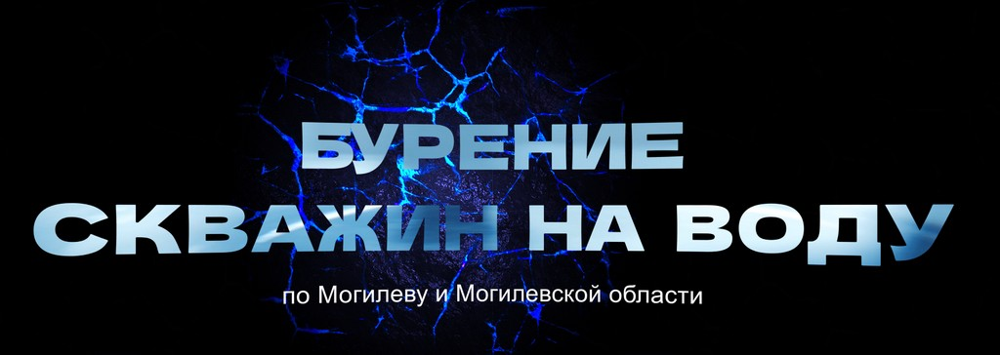

# Water Well Drilling Project



## ✨ Technologies

[](https://react.dev/)
[](https://threejs.org/)
[](https://get.webgl.org/)
[](https://vitejs.dev/)
[](https://vercel.com/docs)

## ✨ Run it locally

To run the project, follow the steps bellow after cloning the repository:

```bash
# Install dependencies
npm install

# Run in production mode
npm run build

# Run local server
npm run dev
```
